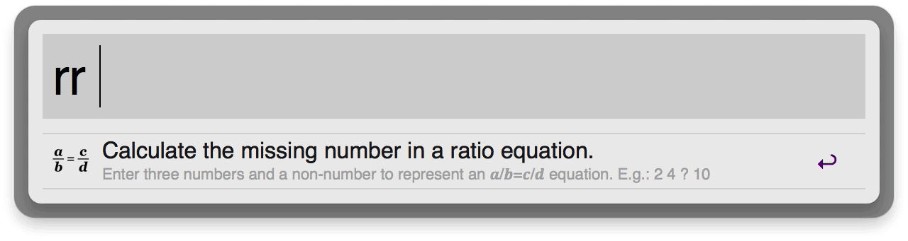

# Alfred Ratio Calculator

Easily calculate the missing number in a ratio. Given the equation **2/4=?/10**, type **rr 2 4 x 10** and get **5**!



**[Download it!](https://github.com/matthewmcvickar/alfred-ratio-calculator/releases/download/v1.0/Ratio.Calculator.alfredworkflow)**

## Installation

1. **[Download the workflow.](https://github.com/matthewmcvickar/alfred-ratio-calculator/releases/download/v1.0/Ratio.Calculator.alfredworkflow)**

2. Double-click on the **Ratio Calculator.alfredworkflow** file you just downloaded to add it to Alfred.

3. Click the **Import** button.

4. The default trigger keyword is `rr`. Change this as you see fit. To do so, double-click the leftmost of the two blocks that represent the workflow—that is, the one that says 'Script Filter'—and change the 'Keyword' field to your preferred trigger.

## Usage

1. Launch Alfred.

2. Start the ratio calculator by typing `rr` and a space.

3. Type a ratio equation as a series of three numbers and one non-number to indicate the missing value.

    For example, to find the missing number in the equation 2/4=x/10, type:

    ```
    2 4 x 10
    ```

    You can use `x`, `?`, or any non-number character to indicate the number you want to find.

4. The result will show up in the feedback list below as you finish your equation. Hit <kbd>Return</kbd> to copy the result to your clipboard.

---

## See Also

This Alfred workflow is based on my [ratio calculator script](https://github.com/matthewmcvickar/ratio-calculator) for the command line, which functions identically but includes several options.

This tool is heavily inspired by [Andrew Hedges’ Aspect Ratio Calculator](http://andrew.hedges.name/experiments/aspect_ratio/).
